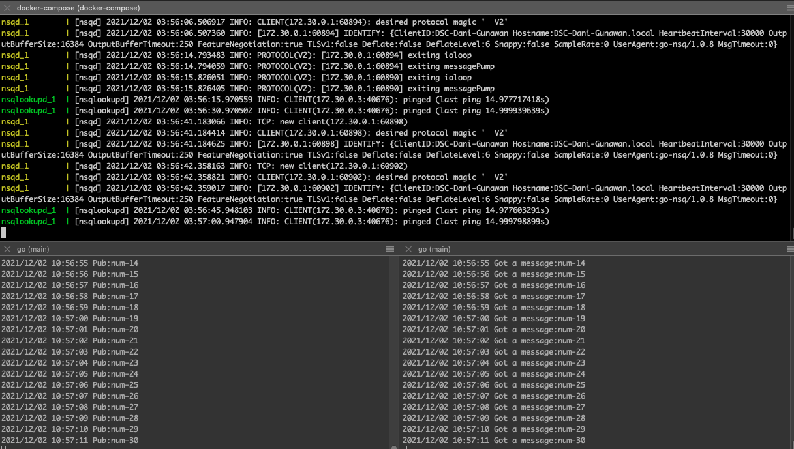
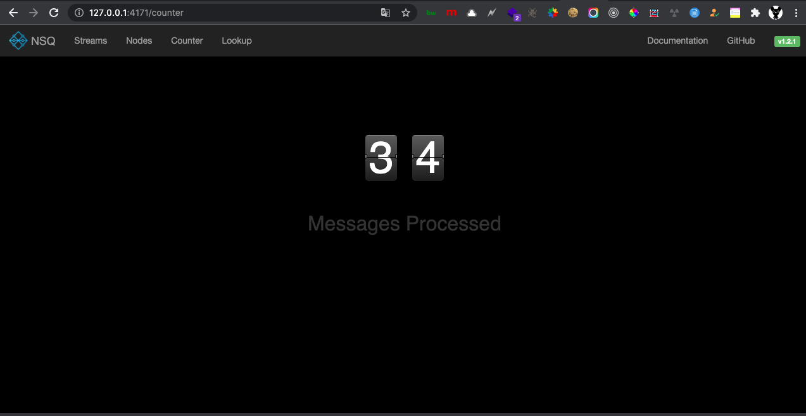

# Description
This is example proof-of-concept for testing nsq distributed message platform 

# Running NSQ On Docker Compose
make run

# Running NSQ On Kubernetes (K8s)

# List examples pubsub on folder proof-of-concept
- golang
- python
- rust
- ruby

# Refferences 
https://nsq.io/

# Screenshot

